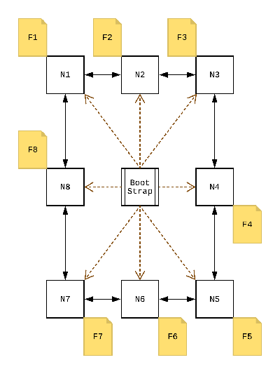

# Network DiFUSE File System - Protocol

## Professor Jennifer Wong-Ma

## **DUE Wednesday May 2nd 2018 @ 11:59pm**

## Introduction

In computing, a distributed file system is any file system that allows access to files from multiple hosts over a computer network.
They allow multiple users on multiple machines to share files and save storage resources.

This document describes the architecture of a simple "distributed" file server that will be referred to as `DiFUSE`.
You will use your knowledge of networking and distributed computing to propose and implement your own version of this architecture.

> :scream: You should not attempt to implement this assignment in C. It will be extremely difficult!

## Overview



A `DiFUSE` network is composed of `n` nodes, each running the `FUSE` interface.
Each node in the network serves as a peer and a client, and uses a single directory to store any number of files.
The network has one bootstrap node which orchestrates the cluster.

Any communication between two peers in the network, or between the bootstrap node and a peer, will be over `TCP` or `UDP`.

## Bootstrap Node

In most decentralized distributed systems the key to getting the system up and running is some sort of `bootstrapping` node.
A `bootstrapping` node provides initial configuration information to newly joining member nodes.

The `bootstrap` node listens for incoming requests from `DiFUSE` applications requesting to join the cluster.
The `bootstrap` node is responsible for maintaining an up-to-date list of all the member nodes.
On startup, a `DiFUSE` node will connect via `TCP` to a known `bootstrap` node.
The `DiFUSE` node will then send the `bootstrap` node information about itself, and receive a list of all other `DiFUSE` nodes.
All connections with the bootstrap node should only last as long as needed to exchange information.
Since the bootstrap node is responsible for orchestrating all nodes in the network, maintaining open TCP connections could potentially overload it.

## DiFUSE Node

`DiFUSE` nodes act as both clients and servers.
This one program is used to manage local file operations, as well as protocol messages to negotiate file transfers over the network.

### File Location Resolution

The `bootstrap` node stores a list of files in the network and their locations, and the `DiFUSE` nodes will query it when it needs to find a file.
The `Difuse` nodes can then connect directly to the node storing the file, on the well known port, in order to perform the desired operation.

#### Node Joins

On startup a `DiFUSE` node connects to the `bootstrap` node letting it know it wants to join the cluster.
The two nodes will then exchange information based on your protocol design.

#### Node Exit

When a `DiFUSE` node wants to exit properly from the cluster it will notify the `bootstrap` node of its departure.
If another node attempts to access any files on the exiting node, the bootstrap node will inform it that the desired node is no longer operational.

## Interface

Like any file system `DiFUSE` provides a seamless interface through the OS' syscall infrastructure.
This is provided by [FUSE](https://en.wikipedia.org/wiki/Filesystem_in_Userspace).
It's a library provided by the Linux kernel that allows one to implement a file system without compiling it into the kernel.

For this project you should use [fusepy](https://pypi.org/project/fusepy/) to create a file system daemon that exposes a standard file system interface to the user.
You can find a good example [here](https://github.com/terencehonles/fusepy/blob/master/examples/memory.py) from the project's repo.
You will need to fill in all or a subset of the 20 methods for the basic file operations which you need for your assignment.
Your implementation for each function will either run the syscall directly on the machine if the desired file is stored there, or use your protocol to perform a `Remote Procedure Call` on the machine that stores the file.

## Protocol Design Document

You will need to design a protocol for `DiFUSE` before you start implementing it.
Your protocol must describe ALL communication that occurs between the different types of nodes in the network.
It must also take into consideration the different error scenarios that can occur during communication.

The design document itself should be similar to the one given to you for HW #1.
You can use a website like the ones listed below to create any diagrams that you may need.
- [websequencediagrams](https://www.websequencediagrams.com/)
- [Lucidchart](https://www.lucidchart.com)

> :nerd: you can always go full RFC style and make some cool ascii art
>
> :nerd: or draw it out on good ol' pen & paper if you prefer

## How to submit your assignment

A protocol design document is due in class on **April 19th**.
Once all documents have been graded and handed back with written feedback, another homework document describing how you can configure, run, and test such a system will be released.

## Assignment Tiers

This assignment is broken into tiers that you can choose to complete for more credit.

The base assignment is worth 50 points and the total assignment is worth 60 points.

When implementing these tiers, you MUST remove the file list from the bootstrap node.

> :nerd: We suggest that you add a flag to activate the different tiers rather than deleting code.

|  Optional Additions | Points |
|:--------------------|:------:|
| Consistent Hashing  | 20     |
| Replication         | 25     |
| Client Side Caching | 20     |

### Consistent Hashing (20 points)

Modify the `bootstrap` node so that it no longer keeps track of the file's locations.
Nodes in the network will now use `consistent hashing` to determine the locations of files in the network.

On node joins/removals your protocol needs to be able to move a subset of files to the correct location.

### Replication (25 points)

Modify the protocol to support replication.
There are a couple ways to do this but we recommend that you either implement a master-slave setup, or use a second hash function to store the file on another node in the network.
If implemented correctly no file should be lost when a node leaves the cluster.

### Client Side Caching (20 points)

Cache file data on the client when requested.
Make sure to flush the results on writes or close.

> :thinking: Your implementation must be efficient and account for all possible errors.

> :nerd: **NOTE:** This assignment is yours to make what you want of it.
> Make sure that you and your partner understand and enjoy what you're working on.
> Impress us! Impress yourselves!

## Submission

Tag your hw with `hw3` before the deadline.

## FAQ

- What does the bootstrap node keep track of?

Depends on your implementation, since it changes for each tier.

We would suggest you start with:

    - Node list
    - File list w/ locations

There may be more meta data that your want to store on the bootstrap node.
You can also reduce the metadata with enhancing your DiFUSE implementation.

- Where is the bootstrap node? Should it have peers that can replace it in instance of failure?

It can be co-located with a DiFUSE instance but it is an independent server running on a well known address. (read this address from a config file or something)
A bootstrap node can be entirely replicated in theory since it only holds metadata you could copy everything to two instances.
Since this is an easy solution we don't recommend implementing it.

- If there's only one node and I have replication, what do?

You can't replicate if there is only one node, if there are only two there is only one other option for location to store a given file.

- Grading for this assignment appears unclear, what are the specifics?

For the basic project you can receive 60 points.
Additions to your `DiFUSE` are worth the credit stated in their section.

- What's replication?

Having duplicate copies of the same file or entire node elsewhere in the cluster.
You can implement this without hashing.
If you do have hashing you'll need 2 hash functions one that is for the duplication.
If you do attempt replication do it to the best of **your** ability rather than meeting distributed algorithm requirements.

- What subset of 20 syscalls in FUSE do we need exactly? (I know that the empty set is a subset.)

You should be able to run:

```sh
$ echo "hello" > a.txt
$ ls
a.txt
$ cat a.txt
hello
```

This represents reading, writing, creating and listing files. It would also be nice to rm files.

> :nerd: Note: Test the memory FUSE example with print statements to see what functions are necessary
> A student discovered that the getattr function needs to be correct so you can pass through to `os.stat`

- Can you have Divjot explain consistent hashing like six more times?

Yes, he is available at any time 24/7, just for you.
But in all honesty please ask on piazza specific questions that aren't [answered here](https://en.wikipedia.org/wiki/Consistent_hashing)

- How big are the files?

Expect only plaintext files that don't exceed 5MB.

- What does a good protocol look like?

This depends on the transfer protocol you choose, TCP/UDP.
If you use TCP think about when you need to acknowledge messages or when you can send them and not care about a reply.
Think about parsing and what would be easier to implement when:

    - detecting the end of a message e.g, `\r\n\r\n`
    - parsing: plain text messages with VERBS like ME2U
    - parsing: a programmatic text format json/xml
    - parsing: an entirely binary protocol

- What's a good way to hash files? What function?

For the sake of this project hash files by name.
You can use python's built in library `hashlib`, where you will find the `md5` or `sha` functions.

- If I've done replication and a Node leaves, are the copies originals now? Do they have to be moved / rehashed?

The copies are originals now.
You can continue to hash them with the second 'replication' hash function but it may become confusing.
It would also make sense to move the files around based on the original hash function.
As long as they still persist.

- Do nodes persist data? If yes, how does reentering a cluster with existing files work?

If you start up a node and it already has persisted files those should be shared with the network for sake of simplicity.
If you have files that conflict in name with existing files on the network, you can choose what to do.
Append a number so that it has a different name.
Skip adding the file, but print out a message in this instance.

- Can we use IPv6 anycast features?

Yes although TCP probably prevents you from using this feature.
Research it a little and if it there's isn't an easy use case we recommend against it.
